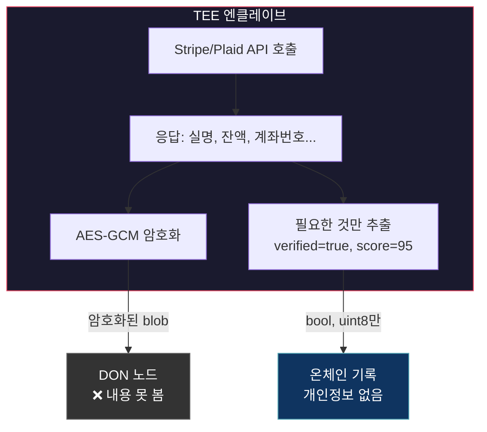
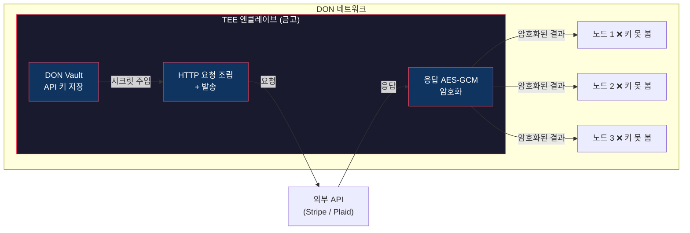
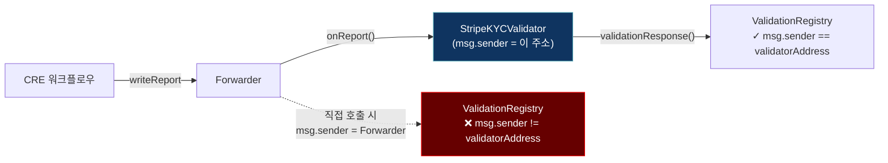
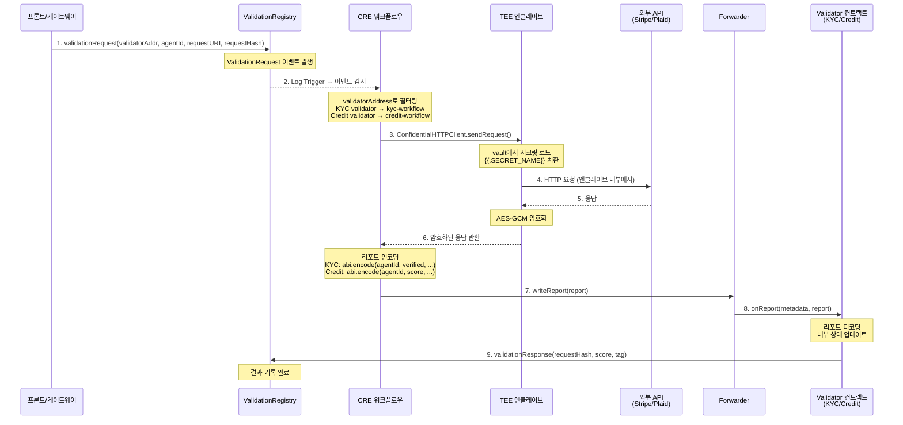
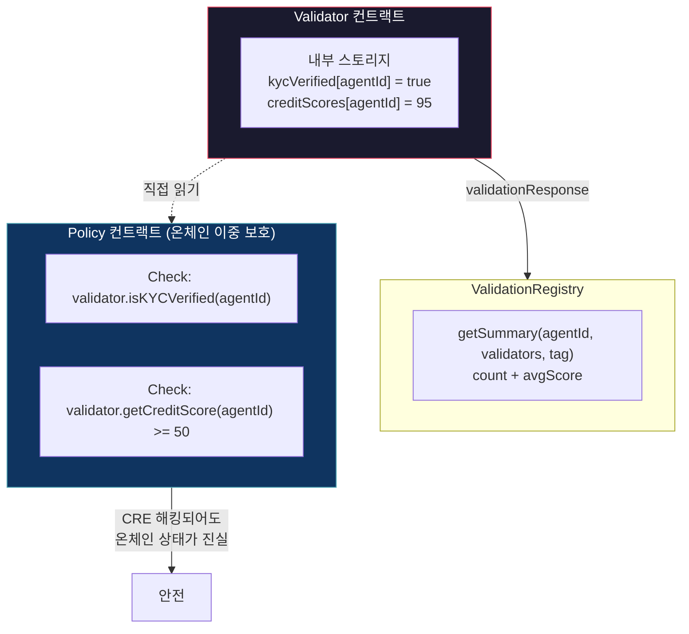
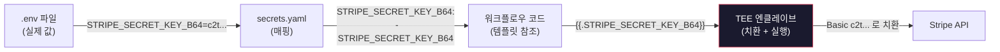
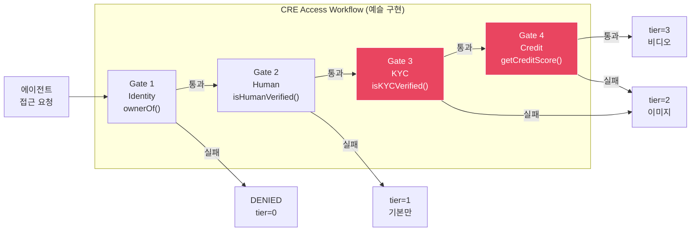
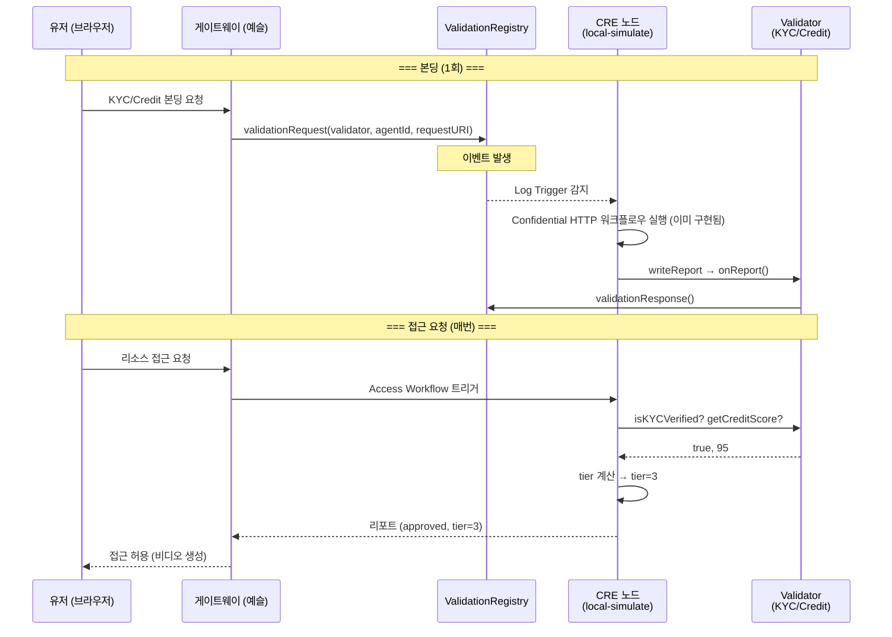

# Confidential HTTP 가이드 (예슬용)

> 재욱이 구현 완료한 KYC + Credit 워크플로우 설명 + 예슬이 연동해야 할 부분 정리
> Chain: Base Sepolia (84532)

---

## 1. Confidential HTTP란?

일반 HTTP는 DON의 각 노드가 API 키를 직접 들고 요청을 보냄 → 노드마다 키가 노출됨.

Confidential HTTP는 이걸 해결:
- API 키가 **DON vault (TEE 엔클레이브)** 안에만 존재
- 개별 노드는 키를 **절대 못 봄**
- HTTP 요청은 엔클레이브 안에서 조립 + 발송
- 응답도 **AES-GCM으로 암호화**되어 DON 네트워크를 통과

> 한 줄 요약: "API 키는 금고 안에 있고, 금고 안에서 요청을 보내고, 결과도 암호화해서 내보냄"

### 1.1 응답 암호화 (AES-GCM)가 왜 필요한지

API 키 보호만이 전부가 아님. `encryptOutput: true`로 **응답 자체를 암호화**하는 이유:

**민감 데이터 보호:**
- Stripe 응답에는 유저의 실명, 생년월일, 주소, 신분증 정보가 포함됨
- Plaid 응답에는 은행 계좌 잔액, 거래 내역, 계좌번호가 포함됨
- 이 데이터가 DON 노드들 사이를 평문으로 돌아다니면 개인정보 유출 리스크

**노드 오퍼레이터 불신 모델:**
- DON 노드는 여러 독립된 오퍼레이터가 운영
- 노드 오퍼레이터가 악의적이면 응답 데이터를 가로챌 수 있음
- AES-GCM으로 암호화하면 노드가 응답 내용을 못 봄 — TEE 안에서만 복호화 가능

**온체인에 민감 데이터가 올라가지 않는 구조:**
- 워크플로우는 응답에서 필요한 것만 추출 (verified=true, score=95)
- 원본 응답(개인정보)은 온체인에 절대 안 올라감
- 온체인에는 해시값(`sessionHash`, `dataHash`)만 기록 → 추적 가능하되 내용은 비공개



### 1.2 전체 구조



---

## 2. 우리가 만든 컨트랙트

### 2.0 왜 ValidationRegistry에 바로 안 넣고 별도 컨트랙트를 만들었는지

"CRE가 결과를 바로 `ValidationRegistry.validationResponse()`에 쓰면 되는 거 아님?" → 안 됨. 이유:

**1. `validationResponse()`는 `msg.sender == validatorAddress`를 강제함**

```solidity
// ValidationRegistry 내부
function validationResponse(...) external {
    require(msg.sender == s.validatorAddress, "Only validator can respond");
    ...
}
```

CRE는 Forwarder를 통해 트랜잭션을 보냄. `msg.sender`가 Forwarder 주소이지, 우리가 원하는 validator 주소가 아님. 그래서 중간에 **Validator 컨트랙트**가 필요:



**2. 탬퍼프루프 내부 상태가 필요함**

ValidationRegistry의 `getSummary()`는 count + avgScore만 제공 — "몇 번 검증됐고 평균 점수가 얼마다" 수준. 하지만 Policy가 필요한 건:
- KYC: `isKYCVerified(agentId)` — bool 하나
- Credit: `getCreditScore(agentId)` — 정확한 점수 + 임계값 비교

이런 **세밀한 상태**는 validator 컨트랙트 내부에 저장해야 함. 그리고 이 상태는 `onReport()`를 통해서만 변경 가능 → CRE Forwarder만 쓸 수 있음 → 탬퍼프루프.

**3. 이중 보호 (Double Protection)의 핵심**

```
CRE 리포트: "이 에이전트 승인해줘" (오프체인 판단)
    ↓
Policy: "진짜? 내가 직접 validator한테 물어볼게" (온체인 검증)
    ↓
validator.isKYCVerified(agentId) → true? → 통과
                                → false? → 거부 (CRE가 거짓말해도 걸림)
```

ValidationRegistry만 있으면 이 이중 보호가 불가능. validator 컨트랙트가 있어야 Policy가 **독립적으로** 상태를 확인할 수 있음.

### 2.1 Validator 컨트랙트

| 컨트랙트 | 주소 (Base Sepolia) | 역할 |
|----------|---------------------|------|
| **StripeKYCValidator** | `0x4e66fe730ae5476e79e70769c379663df4c61a8b` | Stripe Identity KYC 결과 저장 |
| **PlaidCreditValidator** | `0xceb46c0f2704d2191570bd81b622200097af9ade` | Plaid 신용점수 저장 (0-100) |

**StripeKYCValidator 인터페이스:**
```solidity
function isKYCVerified(uint256 agentId) external view returns (bool);
function getKYCData(uint256 agentId) external view returns (
    bool verified, bytes32 sessionHash, uint256 verifiedAt
);
```

**PlaidCreditValidator 인터페이스:**
```solidity
function getCreditScore(uint256 agentId) external view returns (uint8);   // 0-100
function hasCreditScore(uint256 agentId) external view returns (bool);
function getCreditData(uint256 agentId) external view returns (
    uint8 score, bytes32 dataHash, uint256 verifiedAt, bool hasScore
);
```

### 2.2 Policy 컨트랙트

| 컨트랙트 | 주소 (Base Sepolia) | 역할 |
|----------|---------------------|------|
| **KYCPolicy** | `0xcc2998899ef3d4a0695340a8e548fe6b4527f2f5` | Tier 3 정책 (6개 체크) |
| **CreditPolicy** | `0xc53951d8f16016d43b1153a6889cf69d444bb5e9` | Tier 4 정책 (8개 체크) |

### 2.3 티어 모델

데모에서는 KYC + Credit을 **단일 Tier 3**으로 통합 (Premium 리소스가 없으므로):

| Tier | 검증 | 리소스 |
|:---:|------|--------|
| 0 | 없음 | DENIED |
| 1 | 등록 (ERC-8004 NFT) | 기본 API |
| 2 | + World ID | 이미지 생성 |
| 3 | + KYC (Stripe) + Credit (Plaid) | 비디오 생성 |

---

## 3. 전체 흐름: ValidationRegistry 등록까지

### 3.1 본딩 흐름 다이어그램



### 3.2 단계별 상세

**1단계: 검증 요청**
```solidity
// 프론트 또는 게이트웨이가 호출
ValidationRegistry.validationRequest(
    validatorAddress,  // StripeKYCValidator 또는 PlaidCreditValidator 주소
    agentId,           // 검증할 에이전트 NFT ID
    requestURI,        // "stripe:<sessionId>" 또는 "plaid:<agentId>"
    requestHash        // 유니크 해시
);
// → ValidationRequest 이벤트 발생
```

**2단계: CRE가 이벤트 감지**
- Log Trigger가 ValidationRegistry 주소를 감시
- `validatorAddress`로 필터링: 어떤 워크플로우가 처리할지 결정

**3-6단계: Confidential HTTP**
- TEE 안에서 API 키 주입 → 요청 → 응답 암호화 (아래 섹션 4에서 상세 설명)

**7-8단계: 리포트 전송**
- CRE → Forwarder → Validator.onReport()

**9단계: Validator가 이중 저장**
- **자기 내부 스토리지**: `kycVerified[agentId] = true` 또는 `creditScores[agentId] = 95`
- **ValidationRegistry에 기록**: `validationResponse(requestHash, score, ..., tag)`

### 3.3 이중 저장을 하는 이유



Policy가 validator 내부 상태를 **직접** 읽어서 확인. CRE가 해킹당해서 가짜 리포트를 보내도, validator 내부 상태가 안 바뀌면 Policy 체크에서 걸림.

---

## 4. Confidential HTTP 구현 상세

### 4.1 KYC 워크플로우 (Stripe Identity)

```typescript
const confidentialHttpClient = new cre.capabilities.ConfidentialHTTPClient();

const stripeResp = confidentialHttpClient.sendRequest(runtime, {
  vaultDonSecrets: [
    { key: "STRIPE_SECRET_KEY_B64", namespace: "" },
  ],
  request: {
    url: `https://api.stripe.com/v1/identity/verification_sessions/${sessionId}`,
    method: "GET",
    multiHeaders: {
      "Authorization": { values: ["Basic {{.STRIPE_SECRET_KEY_B64}}"] },
    },
    encryptOutput: true,  // AES-GCM 암호화
  },
}).result();

// 응답 파싱
const responseBody = new TextDecoder().decode(stripeResp.body);
const parsed = JSON.parse(responseBody);
const verified = parsed.status === "verified";  // true/false
```

- `{{.STRIPE_SECRET_KEY_B64}}` → vault에서 자동 주입
- `encryptOutput: true` → 응답이 AES-GCM으로 암호화되어 나옴
- 결과: `verified=true` → `isKYCVerified[agentId] = true` 온체인 기록

### 4.2 Credit 워크플로우 (Plaid)

```typescript
const confidentialHttpClient = new cre.capabilities.ConfidentialHTTPClient();

const plaidResp = confidentialHttpClient.sendRequest(runtime, {
  vaultDonSecrets: [
    { key: "PLAID_CLIENT_ID", namespace: "" },
    { key: "PLAID_SECRET", namespace: "" },
    { key: "PLAID_ACCESS_TOKEN", namespace: "" },
  ],
  request: {
    url: "https://sandbox.plaid.com/accounts/balance/get",
    method: "POST",
    bodyString: '{"client_id":"{{.PLAID_CLIENT_ID}}","secret":"{{.PLAID_SECRET}}","access_token":"{{.PLAID_ACCESS_TOKEN}}"}',
    multiHeaders: {
      "Content-Type": { values: ["application/json"] },
    },
    encryptOutput: true,
  },
}).result();

// 응답 파싱 → 신용점수 계산
const responseBody = new TextDecoder().decode(plaidResp.body);
const accounts = JSON.parse(responseBody).accounts;
const score = computeCreditScore(accounts);  // 0-100
```

신용점수 계산 로직:
| 항목 | 배점 |
|------|------|
| 총 잔액 | 40점 |
| 계좌 수 | 10점 |
| 마이너스 잔액 없음 | 30점 |
| 계좌 유형 다양성 | 20점 |

### 4.3 시크릿 설정 구조



**secrets.yaml:**
```yaml
secretsNames:
  STRIPE_SECRET_KEY_B64:
    - STRIPE_SECRET_KEY_B64
  PLAID_CLIENT_ID:
    - PLAID_CLIENT_ID
  PLAID_SECRET:
    - PLAID_SECRET
  PLAID_ACCESS_TOKEN:
    - PLAID_ACCESS_TOKEN
```

**.env** (시뮬레이션용 — 실제 DON에서는 vault에 업로드):
```
STRIPE_SECRET_KEY_B64=<base64 encoded stripe secret key>
PLAID_CLIENT_ID=<plaid client id>
PLAID_SECRET=<plaid secret>
PLAID_ACCESS_TOKEN=<plaid access token>
```

---

## 5. 예슬이 해야 할 것

### 5.1 Access Workflow에서 Gate 3/4 추가

Access Workflow는 Confidential HTTP를 직접 쓸 필요 없음. **온체인 상태만 읽으면 됨:**

```
기존 (Tier 2):
  Gate 1: IdentityRegistry.ownerOf(agentId)                    → 등록?
  Gate 2: WorldIDValidator.isHumanVerified(agentId)             → 인간?

추가 (Tier 3):
  Gate 3: StripeKYCValidator.isKYCVerified(agentId)             → KYC 완료?
  Gate 4: PlaidCreditValidator.getCreditScore(agentId) >= 50    → 신용 통과?
```



### 5.2 Forwarder 설정 (완료)

모든 컨트랙트의 Forwarder가 설정 완료됨:

| 컨트랙트 | 현재 Forwarder | 상태 |
|----------|---------------|------|
| StripeKYCValidator | `0x82300bd7c3958625581cc2F77bC6464dcEcDF3e5` | **설정 완료** |
| PlaidCreditValidator | `0x82300bd7c3958625581cc2F77bC6464dcEcDF3e5` | **설정 완료** |
| WhitewallConsumer | `0x82300bd7c3958625581cc2F77bC6464dcEcDF3e5` | **설정 완료** |

`0x82300bd7...`는 **체인링크가 Base Sepolia에 배포한 공식 KeystoneForwarder** (싱글톤). 별도 배포 필요 없음.

> 이 주소는 체인링크 공식 [Forwarder Directory](https://docs.chain.link/cre/guides/workflow/using-evm-client/forwarder-directory-ts)에서 확인 가능.

### 5.3 게이트웨이 연동



### 5.4 체크리스트

| # | 작업 | 설명 |
|---|------|------|
| 1 | Access Workflow에 Gate 3/4 추가 | `isKYCVerified()`, `getCreditScore()` 읽기 |
| 2 | 티어 계산 로직 | G1+G2 → tier=2, G1+G2+G3+G4 → tier=3 |
| 3 | 게이트웨이 → CRE 연동 | `validationRequest` tx 발행 → CRE 워크플로우 자동 실행 |

> **참고:** Forwarder 설정은 3개 컨트랙트 모두 완료됨 (섹션 5.2 참고). 별도 작업 필요 없음.

---

## 6. 데모에서 어떻게 보여야 하는지

Act 4 (Financial Agent) 시뮬레이션에서 터미널 로그가 Confidential HTTP를 강조:

```
[GATE 3]  KYC: Stripe Identity via Confidential HTTP
[CRE]     ┌─ TEE 엔클레이브 초기화
[CRE]     │  DON vault에서 STRIPE_SECRET_KEY 로드
[CRE]     │  ⚠️  키가 노드에 노출되지 않음
[CRE]     │  엔클레이브 내부에서 Stripe API 호출
[CRE]     └─ 응답 AES-GCM 암호화 완료
[GATE 3]  ✓ status=verified → KYC 통과

[GATE 4]  Credit Score: Plaid via Confidential HTTP
[CRE]     ┌─ DON vault에서 PLAID 시크릿 3개 로드
[CRE]     │  ⚠️  키가 노드에 노출되지 않음
[CRE]     │  엔클레이브 내부에서 Plaid API 호출
[CRE]     └─ 응답 AES-GCM 암호화 완료
[GATE 4]  ✓ 12 accounts → score: 95/100 → Credit 통과
```

**데모의 핵심 메시지:**
> "API 키가 어디에도 노출되지 않고, TEE 안에서만 사용되고, 응답도 암호화되어 나온다"

---

## 7. 워크플로우 실행 방법

> **CRE CLI v1.1.0 이상 필수.** v1.0.9에서는 `{{.SECRET_NAME}}` 템플릿이 해석 안 됨. `cre update`로 업데이트.

```bash
# 1. ValidationRequest 트랜잭션 발행
cd /path/to/whitewall-os
npx hardhat run scripts/fire-validation-request.ts --network baseSepolia

# 2. KYC 워크플로우 시뮬레이션 (출력된 tx hash 사용)
cre workflow simulate ./workflows/kyc-workflow \
  --target local-simulation \
  --trigger-index 0 \
  --evm-tx-hash <kyc_tx_hash> \
  --evm-event-index 0 \
  --non-interactive --broadcast

# 3. Credit 워크플로우 시뮬레이션
cre workflow simulate ./workflows/credit-workflow \
  --target local-simulation \
  --trigger-index 0 \
  --evm-tx-hash <credit_tx_hash> \
  --evm-event-index 0 \
  --non-interactive --broadcast

# 4. 온체인 결과 확인
npx hardhat run scripts/verify-onchain.ts --network baseSepolia
```

### E2E 테스트 결과 (2026-02-22 확인)

| 워크플로우 | Agent | API 결과 | 온체인 결과 |
|-----------|-------|---------|------------|
| KYC (Stripe) | #998 | `status=verified` | `isKYCVerified(998) = true` |
| Credit (Plaid) | #998 | 12 accounts, score=100 | `getCreditScore(998) = 100` |

---

## 8. 파일 위치 참고

```
whitewall-os/
├── workflows/
│   ├── kyc-workflow/
│   │   ├── main.ts              # Stripe Confidential HTTP 워크플로우
│   │   ├── config.json          # validator 주소, chain 설정
│   │   └── workflow.yaml        # CRE 시뮬레이션 설정
│   └── credit-workflow/
│       ├── main.ts              # Plaid Confidential HTTP 워크플로우
│       ├── config.json
│       └── workflow.yaml
├── contracts/
│   ├── StripeKYCValidator.sol   # KYC 결과 저장 + ValidationRegistry 연동
│   ├── PlaidCreditValidator.sol # 신용점수 저장 + ValidationRegistry 연동
│   └── ace/
│       ├── KYCPolicy.sol        # Tier 3 정책 (6개 체크)
│       └── CreditPolicy.sol     # Tier 4 정책 (8개 체크)
├── scripts/
│   ├── deploy-kyc-credit.ts     # 배포 스크립트
│   ├── fire-validation-request.ts  # 테스트용 ValidationRequest 발행
│   └── verify-onchain.ts        # 온체인 결과 확인
├── secrets.yaml                 # 시크릿 매핑 (vault key → env var)
└── .env                         # 시뮬레이션용 실제 시크릿 값
```
