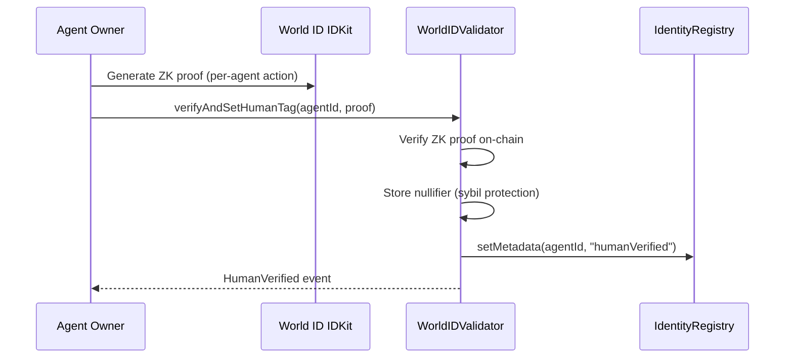
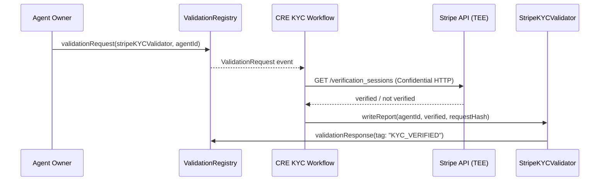
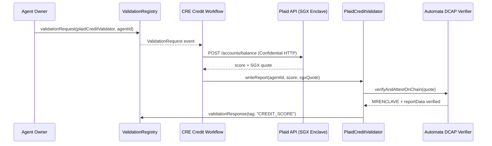
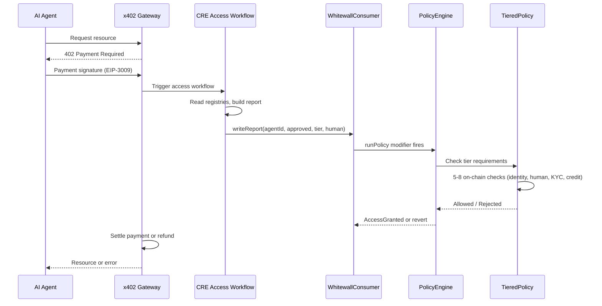

<div align="center">

# Whitewall OS

**On-chain identity and access control for AI agents.**

[](https://www.8004.org)
[](https://docs.chain.link/cre)
[](https://sepolia.basescan.org)
[](https://www.npmjs.com/package/@whitewall-os/sdk)

</div>

---

Whitewall OS answers one question for any on-chain or off-chain service:

> **"Is there a real, verified human behind this AI agent?"**

It layers identity verification (World ID), KYC (Stripe), and credit scoring (Plaid) on top of the [ERC-8004](https://www.8004.org) agent registry. Verification results live on-chain. Access decisions are enforced by Chainlink's Access Control Engine (ACE) with hardware-backed SGX TEE attestation for credit data.

<details>
<summary><strong>Table of Contents</strong></summary>

- [Architecture](#architecture)
- [Repositories](#repositories)
- [How It Works](#how-it-works)
- [Tiered Access Model](#tiered-access-model)
- [Deployed Contracts (Base Sepolia)](#deployed-contracts-base-sepolia)
- [SDK](#sdk)
- [CRE Workflows](#cre-workflows)
- [Tech Stack](#tech-stack)
- [Getting Started](#getting-started)
- [ERC-8004 Protocol](#erc-8004-trustless-agents)

</details>

---

## Architecture


---

## Repositories

| Repository | What it does | Language |
|:-----------|:-------------|:---------|
| [**Verified-Agent-Hub**](https://github.com/hihi-yessir/Verified-Agent-Hub) | Smart contracts, ACE policies, validators, SGX TEE, TypeScript + Go SDK | Solidity, TypeScript, Go |
| [**whitewall-cre**](https://github.com/hihi-yessir/whitewall-cre) | Chainlink CRE workflows — access, KYC, credit verification | Go |
| [**whitewall**](https://github.com/hihi-yessir/whitewall) | Demo frontend — bonding, KYC, credit, tier-gated access | TypeScript |
| [**x402-auth-gateway**](https://github.com/hihi-yessir/x402-auth-gateway) | x402 payment-gated proxy — 402 challenge, payment hold, CRE trigger, settle/refund | Go |

---

## How It Works

### Bonding (World ID — on-chain, single tx)



No oracle, no CRE. Atomic on-chain ZK verification.

### KYC (Stripe Identity — Confidential HTTP)



### Credit Score (Plaid + SGX TEE)



### Access Decision (ACE Pipeline)



---

## Tiered Access Model

| Tier | Verification | What it unlocks | On-chain checks |
|:----:|:-------------|:----------------|:---------------:|
| 0 | None | Denied | — |
| 1 | ERC-8004 registration | Basic API | — |
| 2 | + World ID | Standard access | 5 |
| 3 | + KYC (Stripe) | Elevated access | 6 |
| 4 | + Credit (Plaid) | Full access | 8 |

Each tier is cumulative. Tier 4 requires all previous verifications plus a credit score above the on-chain minimum (default: 50).

---

## Deployed Contracts (Base Sepolia)

### ERC-8004 Singletons (shared, not redeployed)

| Contract | Address |
|:---------|:--------|
| IdentityRegistry | [`0x8004A818BFB912233c491871b3d84c89A494BD9e`](https://sepolia.basescan.org/address/0x8004A818BFB912233c491871b3d84c89A494BD9e) |
| ValidationRegistry | [`0x8004Cb1BF31DAf7788923b405b754f57acEB4272`](https://sepolia.basescan.org/address/0x8004Cb1BF31DAf7788923b405b754f57acEB4272) |

### Whitewall OS Stack

| Contract | Address |
|:---------|:--------|
| PolicyEngine (proxy) | [`0xc7afccc4b97786e34c07e4444496256d2f2b0b9a`](https://sepolia.basescan.org/address/0xc7afccc4b97786e34c07e4444496256d2f2b0b9a) |
| TieredPolicy (proxy) | [`0xdb20a5d22cc7eb2a43628527667021121e80e30d`](https://sepolia.basescan.org/address/0xdb20a5d22cc7eb2a43628527667021121e80e30d) |
| WhitewallConsumer (proxy) | [`0x9670cc85a97c07a1bb6353fb968c6a2c153db99f`](https://sepolia.basescan.org/address/0x9670cc85a97c07a1bb6353fb968c6a2c153db99f) |
| WhitewallExtractor | [`0xa1c721059cbdc04a7bc6ea0026b82bb0d620979d`](https://sepolia.basescan.org/address/0xa1c721059cbdc04a7bc6ea0026b82bb0d620979d) |
| WorldIDValidator (proxy) | [`0xcadd809084debc999ce93384806da8ea90318e11`](https://sepolia.basescan.org/address/0xcadd809084debc999ce93384806da8ea90318e11) |
| StripeKYCValidator (proxy) | [`0xebba79075ad00a22c5ff9a1f36a379f577265936`](https://sepolia.basescan.org/address/0xebba79075ad00a22c5ff9a1f36a379f577265936) |
| PlaidCreditValidator (proxy) | [`0x07e8653b55a3cd703106c9726a140755204c1ad5`](https://sepolia.basescan.org/address/0x07e8653b55a3cd703106c9726a140755204c1ad5) |

All stateful contracts use UUPS proxy pattern. WhitewallExtractor is stateless (no proxy).

---

## SDK

### TypeScript

```bash
npm install @whitewall-os/sdk viem
```

```typescript
import { WhitewallOS } from "@whitewall-os/sdk";
import { createPublicClient, http } from "viem";
import { baseSepolia } from "viem/chains";

const client = createPublicClient({ chain: baseSepolia, transport: http() });
const wos = new WhitewallOS({ publicClient: client, chain: "baseSepolia" });

const status = await wos.getFullStatus(agentId);
// { isRegistered, isHumanVerified, isKYCVerified, creditScore, tier }
```

### Go

```go
import wos "github.com/hihi-yessir/Verified-Agent-Hub/sdk-go"

addrs := wos.ChainAddresses[wos.BaseSepolia]
// addrs.PolicyEngine, addrs.TieredPolicy, etc.
```

---

## CRE Workflows

Three Chainlink CRE workflows run in [whitewall-cre](https://github.com/hihi-yessir/whitewall-cre):

| Workflow | Trigger | Target | What it does |
|:---------|:--------|:-------|:-------------|
| **access** | HTTP (from x402 gateway) | WhitewallConsumer | Reads registries, builds signed report, ACE evaluates |
| **kyc** | `ValidationRequest` event | StripeKYCValidator | Confidential HTTP to Stripe, writes KYC result |
| **credit** | `ValidationRequest` event | PlaidCreditValidator | Confidential HTTP to Plaid, SGX quote, writes score |

All three use Chainlink's Confidential HTTP — API keys live in TEE enclaves, never exposed to individual DON nodes.

---

## Tech Stack

| Layer | Technology |
|:------|:-----------|
| Smart Contracts | Solidity 0.8.26, Hardhat, UUPS Proxies |
| Access Control | Chainlink ACE (PolicyEngine, Extractor, Policy) |
| TEE Attestation | Intel SGX DCAP via Automata verifyAndAttestOnChain |
| Oracle | Chainlink CRE + Confidential HTTP |
| Identity | World ID (on-chain ZK proofs) |
| KYC | Stripe Identity API |
| Credit | Plaid Balance API |
| Payment Gate | x402 (EIP-3009) |
| TypeScript SDK | viem, npm: `@whitewall-os/sdk` |
| Go SDK | go-ethereum |
| Demo Frontend | Next.js |

---

## Getting Started

```bash
# Clone
git clone https://github.com/hihi-yessir/Verified-Agent-Hub.git
cd Verified-Agent-Hub

# Install
npm install

# Compile contracts
npx hardhat compile

# Run tests
npx hardhat test

# Deploy full stack (Base Sepolia)
npx hardhat run scripts/deploy-full-fresh.ts --network baseSepolia
```

For full architecture details, see [ARCHITECTURE.md](./ARCHITECTURE.md).
For deployment history, see [DEPLOYMENT.md](./DEPLOYMENT.md).

---

## Project Structure

```
contracts/
  IdentityRegistryUpgradeable.sol    # ERC-8004 agent registry (ERC-721)
  ValidationRegistryUpgradeable.sol  # Async validator request/response
  WorldIDValidator.sol               # World ID ZK proof verifier
  StripeKYCValidator.sol             # Stripe Identity (CRE target)
  PlaidCreditValidator.sol           # Plaid credit + SGX TEE (CRE target)
  ace/
    WhitewallConsumer.sol            # ACE consumer (access reports)
    WhitewallExtractor.sol           # Report parser
    TieredPolicy.sol                 # 5-8 check tiered policy
    vendor/core/                     # Chainlink ACE framework
  interfaces/
    ISgxDcapVerifier.sol             # SGX attestation interface
  tee/
    SgxVerifiedCreditValidator.sol   # Standalone SGX test vehicle
sdk/                                 # TypeScript SDK (@whitewall-os/sdk)
sdk-go/                              # Go SDK
workflows/                           # CRE workflow configs
scripts/                             # Deploy + admin scripts
test/                                # Hardhat test suite
docs/                                # SGX TEE guides (EN + KR)
```

---
---

# ERC-8004: Trustless Agents

> Everything below is from the upstream [ERC-8004](https://www.8004.org) protocol that Whitewall OS is built on.

Implementation of the ERC-8004 protocol for agent discovery and trust through reputation and validation.

### Contract Addresses

#### Ethereum Mainnet
- **IdentityRegistry**: [`0x8004A169FB4a3325136EB29fA0ceB6D2e539a432`](https://etherscan.io/address/0x8004A169FB4a3325136EB29fA0ceB6D2e539a432)
- **ReputationRegistry**: [`0x8004BAa17C55a88189AE136b182e5fdA19dE9b63`](https://etherscan.io/address/0x8004BAa17C55a88189AE136b182e5fdA19dE9b63)

#### Ethereum Sepolia
- **IdentityRegistry**: [`0x8004A818BFB912233c491871b3d84c89A494BD9e`](https://sepolia.etherscan.io/address/0x8004A818BFB912233c491871b3d84c89A494BD9e)
- **ReputationRegistry**: [`0x8004B663056A597Dffe9eCcC1965A193B7388713`](https://sepolia.etherscan.io/address/0x8004B663056A597Dffe9eCcC1965A193B7388713)

#### Base Mainnet
- **IdentityRegistry**: [`0x8004A169FB4a3325136EB29fA0ceB6D2e539a432`](https://basescan.org/address/0x8004A169FB4a3325136EB29fA0ceB6D2e539a432)
- **ReputationRegistry**: [`0x8004BAa17C55a88189AE136b182e5fdA19dE9b63`](https://basescan.org/address/0x8004BAa17C55a88189AE136b182e5fdA19dE9b63)

#### Base Sepolia
- **IdentityRegistry**: [`0x8004A818BFB912233c491871b3d84c89A494BD9e`](https://sepolia.basescan.org/address/0x8004A818BFB912233c491871b3d84c89A494BD9e)
- **ReputationRegistry**: [`0x8004B663056A597Dffe9eCcC1965A193B7388713`](https://sepolia.basescan.org/address/0x8004B663056A597Dffe9eCcC1965A193B7388713)

#### Polygon Mainnet
- **IdentityRegistry**: [`0x8004A169FB4a3325136EB29fA0ceB6D2e539a432`](https://polygonscan.com/address/0x8004A169FB4a3325136EB29fA0ceB6D2e539a432)
- **ReputationRegistry**: [`0x8004BAa17C55a88189AE136b182e5fdA19dE9b63`](https://polygonscan.com/address/0x8004BAa17C55a88189AE136b182e5fdA19dE9b63)

#### Polygon Amoy
- **IdentityRegistry**: [`0x8004A818BFB912233c491871b3d84c89A494BD9e`](https://amoy.polygonscan.com/address/0x8004A818BFB912233c491871b3d84c89A494BD9e)
- **ReputationRegistry**: [`0x8004B663056A597Dffe9eCcC1965A193B7388713`](https://amoy.polygonscan.com/address/0x8004B663056A597Dffe9eCcC1965A193B7388713)

#### Arbitrum Mainnet
- **IdentityRegistry**: [`0x8004A169FB4a3325136EB29fA0ceB6D2e539a432`](https://arbiscan.io/address/0x8004A169FB4a3325136EB29fA0ceB6D2e539a432)
- **ReputationRegistry**: [`0x8004BAa17C55a88189AE136b182e5fdA19dE9b63`](https://arbiscan.io/address/0x8004BAa17C55a88189AE136b182e5fdA19dE9b63)

#### Arbitrum Testnet
- **IdentityRegistry**: [`0x8004A818BFB912233c491871b3d84c89A494BD9e`](https://sepolia.arbiscan.io/address/0x8004A818BFB912233c491871b3d84c89A494BD9e)
- **ReputationRegistry**: [`0x8004B663056A597Dffe9eCcC1965A193B7388713`](https://sepolia.arbiscan.io/address/0x8004B663056A597Dffe9eCcC1965A193B7388713)

#### Celo Mainnet
- **IdentityRegistry**: [`0x8004A169FB4a3325136EB29fA0ceB6D2e539a432`](https://celoscan.io/address/0x8004A169FB4a3325136EB29fA0ceB6D2e539a432)
- **ReputationRegistry**: [`0x8004BAa17C55a88189AE136b182e5fdA19dE9b63`](https://celoscan.io/address/0x8004BAa17C55a88189AE136b182e5fdA19dE9b63)

#### Celo Testnet
- **IdentityRegistry**: [`0x8004A818BFB912233c491871b3d84c89A494BD9e`](https://sepolia.celoscan.io/address/0x8004A818BFB912233c491871b3d84c89A494BD9e)
- **ReputationRegistry**: [`0x8004B663056A597Dffe9eCcC1965A193B7388713`](https://sepolia.celoscan.io/address/0x8004B663056A597Dffe9eCcC1965A193B7388713)

#### Gnosis Mainnet
- **IdentityRegistry**: [`0x8004A169FB4a3325136EB29fA0ceB6D2e539a432`](https://gnosisscan.io/address/0x8004A169FB4a3325136EB29fA0ceB6D2e539a432)
- **ReputationRegistry**: [`0x8004BAa17C55a88189AE136b182e5fdA19dE9b63`](https://gnosisscan.io/address/0x8004BAa17C55a88189AE136b182e5fdA19dE9b63)

#### Scroll Mainnet
- **IdentityRegistry**: [`0x8004A169FB4a3325136EB29fA0ceB6D2e539a432`](https://scrollscan.com/address/0x8004A169FB4a3325136EB29fA0ceB6D2e539a432)
- **ReputationRegistry**: [`0x8004BAa17C55a88189AE136b182e5fdA19dE9b63`](https://scrollscan.com/address/0x8004BAa17C55a88189AE136b182e5fdA19dE9b63)

#### Scroll Testnet
- **IdentityRegistry**: [`0x8004A818BFB912233c491871b3d84c89A494BD9e`](https://sepolia.scrollscan.com/address/0x8004A818BFB912233c491871b3d84c89A494BD9e)
- **ReputationRegistry**: [`0x8004B663056A597Dffe9eCcC1965A193B7388713`](https://sepolia.scrollscan.com/address/0x8004B663056A597Dffe9eCcC1965A193B7388713)

#### Taiko Mainnet
- **IdentityRegistry**: [`0x8004A169FB4a3325136EB29fA0ceB6D2e539a432`](https://taikoscan.io/address/0x8004A169FB4a3325136EB29fA0ceB6D2e539a432)
- **ReputationRegistry**: [`0x8004BAa17C55a88189AE136b182e5fdA19dE9b63`](https://taikoscan.io/address/0x8004BAa17C55a88189AE136b182e5fdA19dE9b63)

#### Monad Mainnet
- **IdentityRegistry**: [`0x8004A169FB4a3325136EB29fA0ceB6D2e539a432`](https://monadscan.com/address/0x8004A169FB4a3325136EB29fA0ceB6D2e539a432)
- **ReputationRegistry**: [`0x8004BAa17C55a88189AE136b182e5fdA19dE9b63`](https://monadscan.com/address/0x8004BAa17C55a88189AE136b182e5fdA19dE9b63)

#### Monad Testnet
- **IdentityRegistry**: [`0x8004A818BFB912233c491871b3d84c89A494BD9e`](https://monad-testnet.socialscan.io/address/0x8004a818bfb912233c491871b3d84c89a494bd9e)
- **ReputationRegistry**: [`0x8004B663056A597Dffe9eCcC1965A193B7388713`](https://monad-testnet.socialscan.io/address/0x8004b663056a597dffe9eccc1965a193b7388713)

#### BSC Mainnet
- **IdentityRegistry**: [`0x8004A169FB4a3325136EB29fA0ceB6D2e539a432`](https://bscscan.com/address/0x8004A169FB4a3325136EB29fA0ceB6D2e539a432)
- **ReputationRegistry**: [`0x8004BAa17C55a88189AE136b182e5fdA19dE9b63`](https://bscscan.com/address/0x8004BAa17C55a88189AE136b182e5fdA19dE9b63)

#### BSC Testnet
- **IdentityRegistry**: [`0x8004A818BFB912233c491871b3d84c89A494BD9e`](https://testnet.bscscan.com/address/0x8004A818BFB912233c491871b3d84c89A494BD9e)
- **ReputationRegistry**: [`0x8004B663056A597Dffe9eCcC1965A193B7388713`](https://testnet.bscscan.com/address/0x8004B663056A597Dffe9eCcC1965A193B7388713)

More chains coming soon...

## About

This repository implements **ERC-8004 (Trustless Agents)**: a lightweight set of on-chain registries that make agents discoverable and enable trust signals across organizational boundaries.

At a high level, ERC-8004 defines three registries:

- **Identity Registry**: an ERC-721 registry for agent identities (portable, browsable, transferable).
- **Reputation Registry**: a standardized interface for publishing and reading feedback signals.
- **Validation Registry**: hooks for validator smart contracts to publish validation results.

The normative spec lives in `ERC8004SPEC.md`.

## Quickstart

Install dependencies:

```shell
npm install
```

Run tests:

```shell
npm test
```

Or via Hardhat:

```shell
npx hardhat test
```

## Core concepts (from the spec)

### Agent identifier

An agent is identified by:

- **agentRegistry**: `{namespace}:{chainId}:{identityRegistry}` (e.g., `eip155:11155111:0x...`)
- **agentId**: the ERC-721 `tokenId` minted by the Identity Registry

Off-chain payloads (registration files, feedback files, evidence) should include both fields so they can be tied back to the on-chain agent.

### What ERC-8004 does (and doesn't)

- **Discovery**: ERC-8004 makes agents discoverable via an ERC-721 identity whose `tokenURI` points to a registration file.
- **Trust signals**: ERC-8004 standardizes how reputation and validation signals are posted and queried on-chain.
- **Not payments**: payment rails are intentionally out-of-scope; the spec shows how payments *can* enrich feedback signals, but ERC-8004 does not mandate a payment system.

## Registries

### Identity Registry (agent discovery)

The Identity Registry is an upgradeable ERC-721 (`ERC721URIStorage`) where:

- **agentURI** (`tokenURI`) points to the agent registration file (e.g., `ipfs://...` or `https://...`).
- **register** mints a new agent NFT and assigns an `agentId`.
- **setAgentURI** updates the agent's URI.

#### On-chain metadata

The registry also provides optional on-chain metadata:

- `getMetadata(agentId, metadataKey) -> bytes`
- `setMetadata(agentId, metadataKey, metadataValue)`

The reserved key **`agentWallet`** is managed specially:

- It is set automatically on registration (initially to the owner's address).
- It can be updated only after proving control of the new wallet via `setAgentWallet(...)` (EIP-712 / ERC-1271).
- It is cleared on transfer so a new owner must re-verify.
- Helpers: `getAgentWallet(agentId)` and `unsetAgentWallet(agentId)`.

#### Agent registration file (recommended shape)

The `agentURI` should resolve to a JSON document that is friendly to NFT tooling (name/description/image) and also advertises agent endpoints. The spec's registration file includes:

- `type`: schema identifier for the registration format
- `name`, `description`, `image`
- `services`: a list of endpoints (e.g., A2A agent card URL, MCP endpoint, OASF manifest, ENS name, email)
- `registrations`: a list of `{ agentRegistry, agentId }` references to bind the file back to on-chain identity
- `supportedTrust`: optional list such as `reputation`, `crypto-economic`, `tee-attestation`

#### Optional: endpoint domain verification

If an agent advertises an HTTPS endpoint, it can optionally prove domain control by hosting a well-known file (see `ERC8004SPEC.md`). Verifiers can use it to confirm that an endpoint domain is controlled by the same agent identity.

### Reputation Registry (trust signals)

The Reputation Registry stores and exposes feedback signals as a signed fixed-point number:

- `value`: `int128` (signed)
- `valueDecimals`: `uint8` (0–18)

Everything else is optional metadata (tags, endpoint URI, off-chain payload URI + hash).

#### Interpreting `value` + `valueDecimals`

Treat the pair as a signed decimal number:

- Example: `value=9977`, `valueDecimals=2` → `99.77`
- Example: `value=560`, `valueDecimals=0` → `560`

This allows a single on-chain schema to represent percentages, scores, timings, dollar amounts, etc. (the meaning is conveyed by `tag1`/`tag2` and/or the off-chain file).

#### Give feedback

`giveFeedback(...)` records feedback for an agent. The implementation prevents **self-feedback** from the agent owner or approved operators (checked via the Identity Registry).

#### Read + aggregate

Typical read paths:

- `readFeedback(agentId, clientAddress, feedbackIndex)`
- `readAllFeedback(agentId, clientAddresses, tag1, tag2, includeRevoked)`
- `getSummary(agentId, clientAddresses, tag1, tag2)` → returns `(count, summaryValue, summaryValueDecimals)`

Note: `getSummary` requires `clientAddresses` to be provided (non-empty) to reduce Sybil/spam risk.

#### Responses & revocation

- Clients can revoke their feedback: `revokeFeedback(agentId, feedbackIndex)`
- Anyone can append responses: `appendResponse(agentId, clientAddress, feedbackIndex, responseURI, responseHash)`

## Suggested end-to-end flow

1. **Register an agent** in the Identity Registry (`register(...)`) and get an `agentId`.
2. **Publish a registration file** (e.g., on IPFS/HTTPS) and set it as the `agentURI` via `setAgentURI(agentId, ...)`.
3. (Optional) **Set a verified receiving wallet** via `setAgentWallet(...)` (EIP-712/1271 proof).
4. **Collect feedback** from users/clients via `giveFeedback(...)` on the Reputation Registry.
5. **Aggregate trust** in-app using `getSummary(...)` and/or pull raw feedback via `readAllFeedback(...)` for off-chain scoring.

### Validation Registry

> **Warning**
>
> The **Validation Registry** portion of the ERC-8004 spec is **still under active update and discussion with the TEE community**. This section will be revised and expanded in a follow-up spec update **later this year**.

The current implementation supports:

- `validationRequest(validatorAddress, agentId, requestURI, requestHash)` (must be called by owner/operator of `agentId`)
- `validationResponse(requestHash, response, responseURI, responseHash, tag)` (must be called by the requested validator)
- Read functions: `getValidationStatus`, `getSummary`, `getAgentValidations`, `getValidatorRequests`

## JSON payloads (off-chain)

### Agent registration file (Identity Registry)

The agent's `agentURI` should resolve to a registration file (see `ERC8004SPEC.md`) containing human-friendly metadata plus a list of advertised services/endpoints (e.g., A2A, MCP, OASF, ENS, email).

### Feedback file (optional, Reputation Registry)

The on-chain feedback can optionally reference a richer off-chain JSON payload (again see the spec) that includes:

- `agentRegistry`, `agentId`, `clientAddress`, `createdAt`
- `value`, `valueDecimals`
- Optional categorization under namespaces like `mcp`, `a2a`, and `oasf`

Tip: keep the on-chain call minimal (tags + numeric signal), and put verbose context (task transcript, payment proof, artifacts, model/version info) in the off-chain JSON referenced by `feedbackURI`.

## Resources

- [ERC-8004 Full Specification](./ERC8004SPEC.md)
- [ERC-8004 Website](https://www.8004.org)
- [Hardhat Documentation](https://hardhat.org/docs)
- [EIP-721: Non-Fungible Token Standard](https://eips.ethereum.org/EIPS/eip-721)

## License

CC0 - Public Domain

## Contacts

ERC-8004 is a community effort coordinated by Marco De Rossi (MetaMask) and Davide Crapis (EF), with the co-authorship of Jordan Ellis (Google) and Erik Reppel (Coinbase). Our core team is joined by Leonard Tan (MetaMask), Vitto Rivabella (EF), and Isha Sangani (EF).

Check out our website at [8004.org](https://www.8004.org) and reach out at `team@8004.org`.
