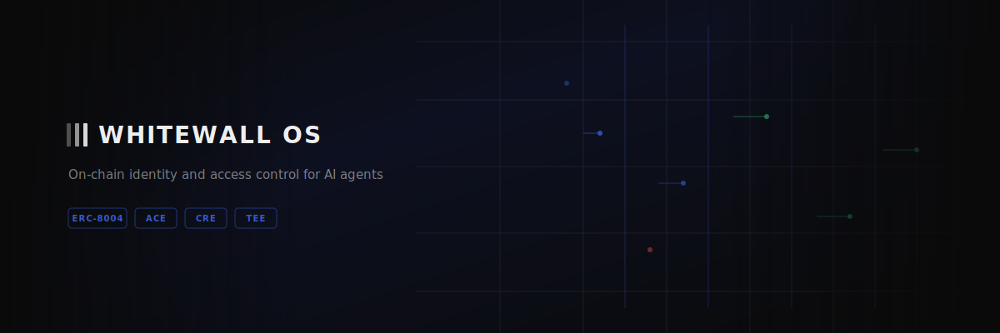
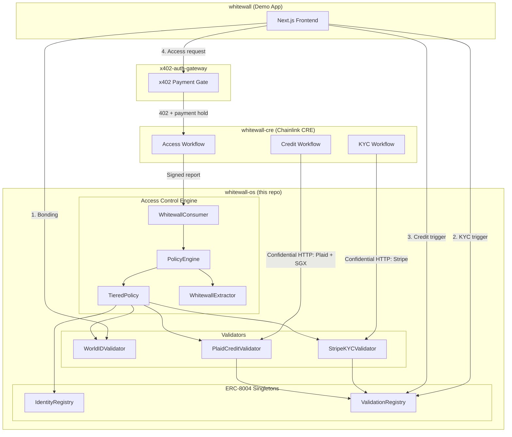
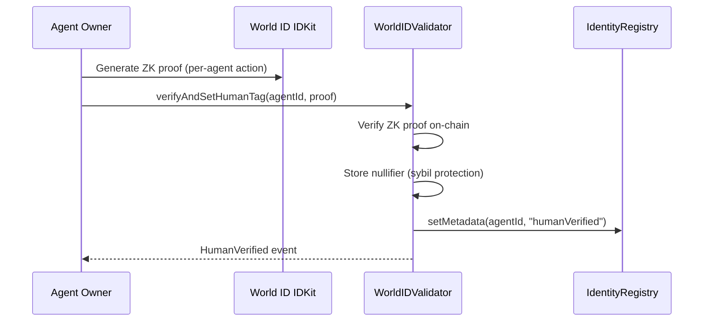
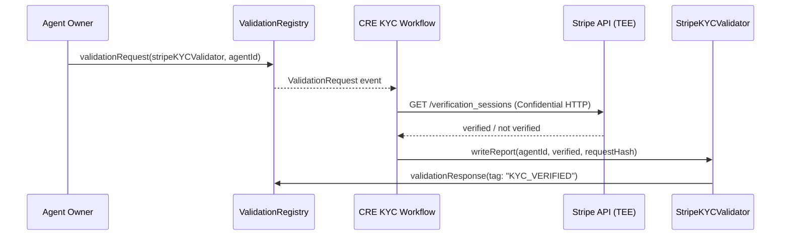
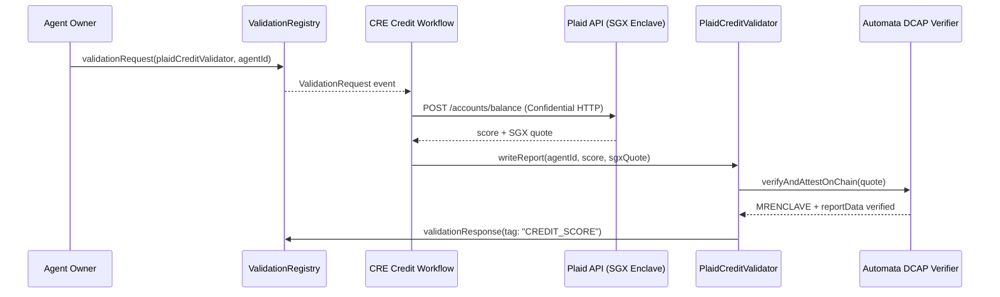
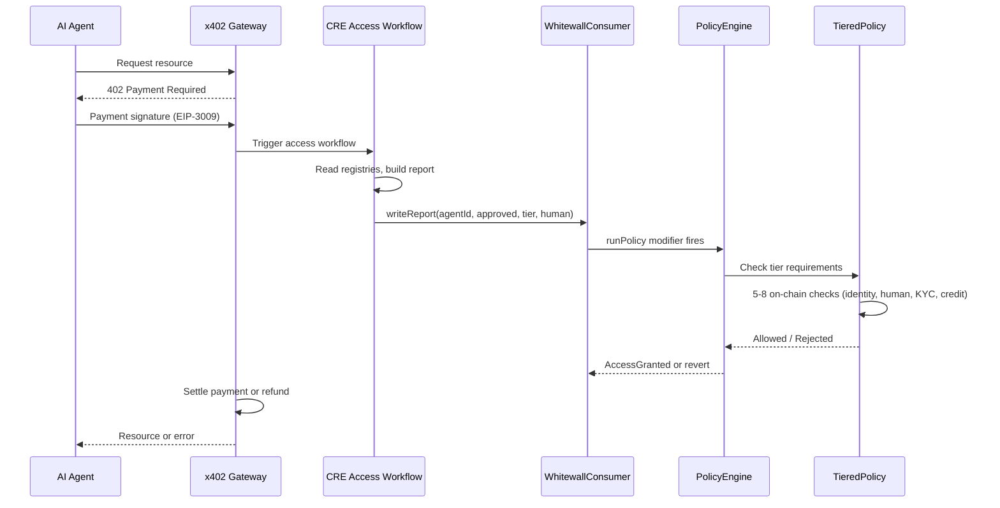

<div align="center">



# Whitewall OS

**On-chain identity and access control for AI agents.**

[](https://www.8004.org)
[](https://docs.chain.link/cre)
[](https://worldcoin.org/world-id)
[](https://sepolia.basescan.org)
[](https://www.npmjs.com/package/@whitewall-os/sdk)

</div>

---

Whitewall OS answers one question for any on-chain or off-chain service:

> **"Is there a real, verified human behind this AI agent?"**

It layers identity verification (World ID), KYC (Stripe), and credit scoring (Plaid) on top of the [ERC-8004](https://www.8004.org) agent registry. Verification results live on-chain. Access decisions are enforced by Chainlink's Access Control Engine (ACE) with hardware-backed SGX TEE attestation for credit data.

<details>
<summary><strong>Table of Contents</strong></summary>

- [Architecture](#architecture)
- [Repositories](#repositories)
- [How It Works](#how-it-works)
- [Tiered Access Model](#tiered-access-model)
- [Deployed Contracts (Base Sepolia)](#deployed-contracts-base-sepolia)
- [SDK](#sdk)
- [CRE Workflows](#cre-workflows)
- [Chainlink Products Used](#chainlink-products-used)
- [Tech Stack](#tech-stack)
- [Getting Started](#getting-started)
- [ERC-8004 Protocol](#erc-8004-protocol)

</details>

---

## Architecture



---

## Repositories

| Repository | What it does | Language |
|:-----------|:-------------|:---------|
| [**whitewall-os**](https://github.com/hihi-yessir/whitewall-os) | Smart contracts, ACE policies, validators, SGX TEE, TypeScript + Go SDK | Solidity, TypeScript, Go |
| [**whitewall-cre**](https://github.com/hihi-yessir/whitewall-cre) | Chainlink CRE workflows — access, KYC, credit verification | Go |
| [**whitewall**](https://github.com/hihi-yessir/whitewall) | Demo frontend — bonding, KYC, credit, tier-gated access | TypeScript |
| [**x402-auth-gateway**](https://github.com/hihi-yessir/x402-auth-gateway) | x402 payment-gated proxy — 402 challenge, payment hold, CRE trigger, settle/refund | Go |

---

## How It Works

### Bonding (World ID — on-chain, single tx)



No oracle, no CRE. Atomic on-chain ZK verification.

### KYC (Stripe Identity — Confidential HTTP)



### Credit Score (Plaid + SGX TEE)



### Access Decision (ACE Pipeline)



---

## Tiered Access Model

| Tier | Verification | What it unlocks | On-chain checks |
|:----:|:-------------|:----------------|:---------------:|
| 0 | None | Denied | — |
| 1 | ERC-8004 registration | Basic API | — |
| 2 | + World ID | Standard access | 5 |
| 3 | + KYC (Stripe) | Elevated access | 6 |
| 4 | + Credit (Plaid) | Full access | 8 |

Each tier is cumulative. Tier 4 requires all previous verifications plus a credit score above the on-chain minimum (default: 50).

---

## Deployed Contracts (Base Sepolia)

### ERC-8004 Singletons (shared, not redeployed)

| Contract | Address |
|:---------|:--------|
| IdentityRegistry | [`0x8004A818BFB912233c491871b3d84c89A494BD9e`](https://sepolia.basescan.org/address/0x8004A818BFB912233c491871b3d84c89A494BD9e) |
| ValidationRegistry | [`0x8004Cb1BF31DAf7788923b405b754f57acEB4272`](https://sepolia.basescan.org/address/0x8004Cb1BF31DAf7788923b405b754f57acEB4272) |

### Whitewall OS Stack

| Contract | Address |
|:---------|:--------|
| PolicyEngine (proxy) | [`0xc7afccc4b97786e34c07e4444496256d2f2b0b9a`](https://sepolia.basescan.org/address/0xc7afccc4b97786e34c07e4444496256d2f2b0b9a) |
| TieredPolicy (proxy) | [`0xdb20a5d22cc7eb2a43628527667021121e80e30d`](https://sepolia.basescan.org/address/0xdb20a5d22cc7eb2a43628527667021121e80e30d) |
| WhitewallConsumer (proxy) | [`0x9670cc85a97c07a1bb6353fb968c6a2c153db99f`](https://sepolia.basescan.org/address/0x9670cc85a97c07a1bb6353fb968c6a2c153db99f) |
| WhitewallExtractor | [`0xa1c721059cbdc04a7bc6ea0026b82bb0d620979d`](https://sepolia.basescan.org/address/0xa1c721059cbdc04a7bc6ea0026b82bb0d620979d) |
| WorldIDValidator (proxy) | [`0xcadd809084debc999ce93384806da8ea90318e11`](https://sepolia.basescan.org/address/0xcadd809084debc999ce93384806da8ea90318e11) |
| StripeKYCValidator (proxy) | [`0xebba79075ad00a22c5ff9a1f36a379f577265936`](https://sepolia.basescan.org/address/0xebba79075ad00a22c5ff9a1f36a379f577265936) |
| PlaidCreditValidator (proxy) | [`0x07e8653b55a3cd703106c9726a140755204c1ad5`](https://sepolia.basescan.org/address/0x07e8653b55a3cd703106c9726a140755204c1ad5) |

All stateful contracts use UUPS proxy pattern. WhitewallExtractor is stateless (no proxy).

---

## SDK

### TypeScript

```bash
npm install @whitewall-os/sdk viem
```

```typescript
import { WhitewallOS } from "@whitewall-os/sdk";
import { createPublicClient, http } from "viem";
import { baseSepolia } from "viem/chains";

const client = createPublicClient({ chain: baseSepolia, transport: http() });
const wos = new WhitewallOS({ publicClient: client, chain: "baseSepolia" });

const status = await wos.getFullStatus(agentId);
// { isRegistered, isHumanVerified, isKYCVerified, creditScore, tier }
```

### Go

```go
import wos "github.com/hihi-yessir/whitewall-os/sdk-go"

addrs := wos.ChainAddresses[wos.BaseSepolia]
// addrs.PolicyEngine, addrs.TieredPolicy, etc.
```

---

## CRE Workflows

Three Chainlink CRE workflows run in [whitewall-cre](https://github.com/hihi-yessir/whitewall-cre):

| Workflow | Trigger | Target | What it does |
|:---------|:--------|:-------|:-------------|
| **access** | HTTP (from x402 gateway) | WhitewallConsumer | Reads registries, builds signed report, ACE evaluates |
| **kyc** | `ValidationRequest` event | StripeKYCValidator | Confidential HTTP to Stripe, writes KYC result |
| **credit** | `ValidationRequest` event | PlaidCreditValidator | Confidential HTTP to Plaid, SGX quote, writes score |

All three use Chainlink's Confidential HTTP — API keys live in TEE enclaves, never exposed to individual DON nodes.

---

## Chainlink Products Used

| Product | Where | What it does |
|:--------|:------|:-------------|
| **CRE** | [`workflows/access-workflow/main.ts`](workflows/access-workflow/main.ts), [`kyc-workflow`](workflows/kyc-workflow/main.ts), [`credit-workflow`](workflows/credit-workflow/main.ts) | Event-driven workflow runtime — all 3 workflows use `cre.handler()`, `Runner`, and EVM triggers to run verification logic in the DON |
| **Confidential HTTP** | [`kyc-workflow/main.ts#L107`](workflows/kyc-workflow/main.ts) — Stripe API, [`credit-workflow/main.ts#L140`](workflows/credit-workflow/main.ts) — Plaid API | `ConfidentialHTTPClient.sendRequest()` fetches external APIs with encrypted transport — API keys pulled from DON Vault at request time, never exposed to individual nodes |
| **ACE** | [`contracts/ace/`](contracts/ace/) — [PolicyEngine](contracts/ace/vendor/core/PolicyEngine.sol), [TieredPolicy](contracts/ace/TieredPolicy.sol), [WhitewallExtractor](contracts/ace/WhitewallExtractor.sol) | `runPolicy` modifier on [`WhitewallConsumer.onReport()`](contracts/ace/WhitewallConsumer.sol) triggers PolicyEngine → Extractor → TieredPolicy (5-8 on-chain checks per tier) |
| **DON + writeReport** | All 3 workflows call `runtime.report()` + `evmClient.writeReport()` → [`WhitewallConsumer`](contracts/ace/WhitewallConsumer.sol), [`StripeKYCValidator`](contracts/StripeKYCValidator.sol), [`PlaidCreditValidator`](contracts/PlaidCreditValidator.sol) | DON nodes reach consensus, sign the report, and deliver it on-chain via KeystoneForwarder to each contract's `onReport()` |
| **DON Vault** | [`kyc-workflow/main.ts#L110`](workflows/kyc-workflow/main.ts) — `STRIPE_SECRET_KEY_B64`, [`credit-workflow/main.ts#L143`](workflows/credit-workflow/main.ts) — `PLAID_CLIENT_ID`, `PLAID_SECRET`, `PLAID_ACCESS_TOKEN` | `vaultDonSecrets` stores API credentials in the DON's encrypted secret store, injected into Confidential HTTP requests at runtime via `{{.KEY_NAME}}` templates |

---

## Tech Stack

| Layer | Technology |
|:------|:-----------|
| Smart Contracts | Solidity 0.8.26, Hardhat, UUPS Proxies |
| Access Control | Chainlink ACE (PolicyEngine, Extractor, Policy) |
| Workflow Engine | Chainlink CRE + DON |
| Confidential Data | Chainlink Confidential HTTP + DON Vault |
| TEE Attestation | Intel SGX DCAP via Automata verifyAndAttestOnChain |
| Identity | World ID (on-chain ZK proofs) |
| KYC | Stripe Identity API |
| Credit | Plaid Balance API |
| Payment Gate | x402 (EIP-3009) |
| TypeScript SDK | viem, npm: `@whitewall-os/sdk` |
| Go SDK | go-ethereum |
| Demo Frontend | Next.js |

---

## Getting Started

```bash
# Clone
git clone https://github.com/hihi-yessir/whitewall-os.git
cd whitewall-os

# Install
npm install

# Compile contracts
npx hardhat compile

# Run tests
npx hardhat test

# Deploy full stack (Base Sepolia)
npx hardhat run scripts/deploy-full-fresh.ts --network baseSepolia
```

For full architecture details, see [ARCHITECTURE.md](./ARCHITECTURE.md).
For deployment history, see [DEPLOYMENT.md](./DEPLOYMENT.md).

---

## Project Structure

```
contracts/
  IdentityRegistryUpgradeable.sol    # ERC-8004 agent registry (ERC-721)
  ValidationRegistryUpgradeable.sol  # Async validator request/response
  WorldIDValidator.sol               # World ID ZK proof verifier
  StripeKYCValidator.sol             # Stripe Identity (CRE target)
  PlaidCreditValidator.sol           # Plaid credit + SGX TEE (CRE target)
  ace/
    WhitewallConsumer.sol            # ACE consumer (access reports)
    WhitewallExtractor.sol           # Report parser
    TieredPolicy.sol                 # 5-8 check tiered policy
    vendor/core/                     # Chainlink ACE framework
  interfaces/
    ISgxDcapVerifier.sol             # SGX attestation interface
  tee/
    SgxVerifiedCreditValidator.sol   # Standalone SGX test vehicle
sdk/                                 # TypeScript SDK (@whitewall-os/sdk)
sdk-go/                              # Go SDK
workflows/                           # CRE workflow configs
scripts/                             # Deploy + admin scripts
test/                                # Hardhat test suite
docs/                                # SGX TEE guides (EN + KR)
```

---

## ERC-8004 Protocol

This repo is forked from the [ERC-8004 reference implementation](https://github.com/trust-stack/Verified-Agent-Hub). Whitewall OS extends the base IdentityRegistry and ValidationRegistry singletons with verification layers (World ID, KYC, Credit) and Chainlink-powered access control.

<details>
<summary>Full ERC-8004 spec details and multi-chain contract addresses</summary>

ERC-8004 defines three on-chain registries for agent discovery and trust:

- **IdentityRegistry** — ERC-721 agent identities (portable, browsable, transferable)
- **ReputationRegistry** — standardized feedback signals
- **ValidationRegistry** — async validator request/response hooks

See [`ERC8004SPEC.md`](./ERC8004SPEC.md) for the full normative spec, or visit [8004.org](https://www.8004.org).

ERC-8004 is deployed on Ethereum, Base, Polygon, Arbitrum, Celo, Gnosis, Scroll, Taiko, Monad, and BSC (mainnet + testnet). Full address list in the [upstream repo](https://github.com/trust-stack/Verified-Agent-Hub).

</details>

## License

CC0 - Public Domain
